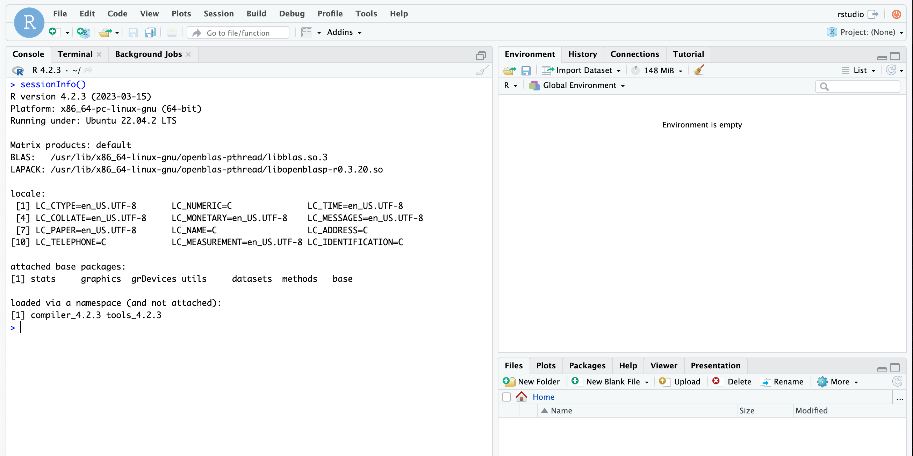

# RStudio on Google Cloud Workstations



This repository contains artifacts to deploy the [free version of RStudio Server](https://posit.co/download/rstudio-server/) to [Google Cloud Workstations](https://cloud.google.com/workstations).

Authors:
- Fabian Hirschmann (<fhirschmann@google.com>)
- Justin Marciszewski (<justinjm@google.com>)

## Deploy RStudio to Cloud Workstations

Define variables:

```bash
PROJECT_ID=$(gcloud config get-value project)
REGION="us-central1"
REPO_NAME="rstudio-cloud-workstations"
IMAGE_NAME="rstudio-cloud-workstations"
IMAGE_URI="${REGION}-docker.pkg.dev/${PROJECT_ID}/${REPO_NAME}/${IMAGE_NAME}:latest

CLUSTER_NAME="ws-cluster1"
```

### Build container image
Create a repository that holds your container image.

```bash
gcloud artifacts repositories create $REPO_NAME --repository-format=docker --location=$REGION
```

Use [Cloud Build](https://cloud.google.com/build) to build the container image and upload it to the repository:

```bash
gcloud builds submit --region=$REGION --tag=$IMAGE_URI
```

Your container image is now available at the following URI:
```
echo $IMAGE_URI
```

### Set up Cloud Workstations

Create a Cloud Workstation Cluster:

```bash
gcloud alpha workstations clusters create ws-cluster1 --region=$REGION
```

Create a Cloud Workstation Configuration utilizing the container image created above

```bash
gcloud alpha workstations configs create rstudio --cluster=$CLUSTER_NAME --region=$REGION --container-custom-image=$IMAGE_URI
```

That's it! You can now start RStudio from the [Cloud Workstations Console](https://console.cloud.google.com/workstations).
